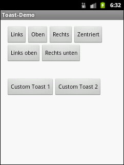
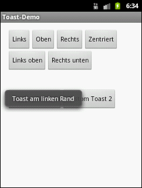
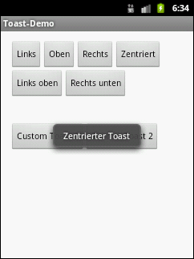
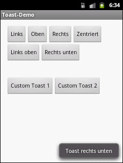
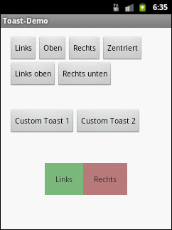
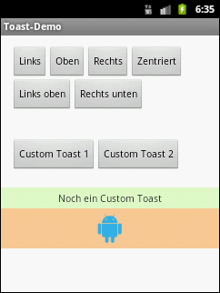

# Android-App "Toast-Demo"

App demonstrates possibilities for [Toast](https://developer.android.com/guide/topics/ui/notifiers/toasts#java) objects in Android.

 

Identifiers (names for classes, variables and methods), (JavaDoc) comments and UI texts are in German only.

 

----
## Screenshots

  

 

  

 

  

 

----
# License

See the [LICENSE file](LICENSE.md) for license rights and limitations (BSD 3-Clause License).
